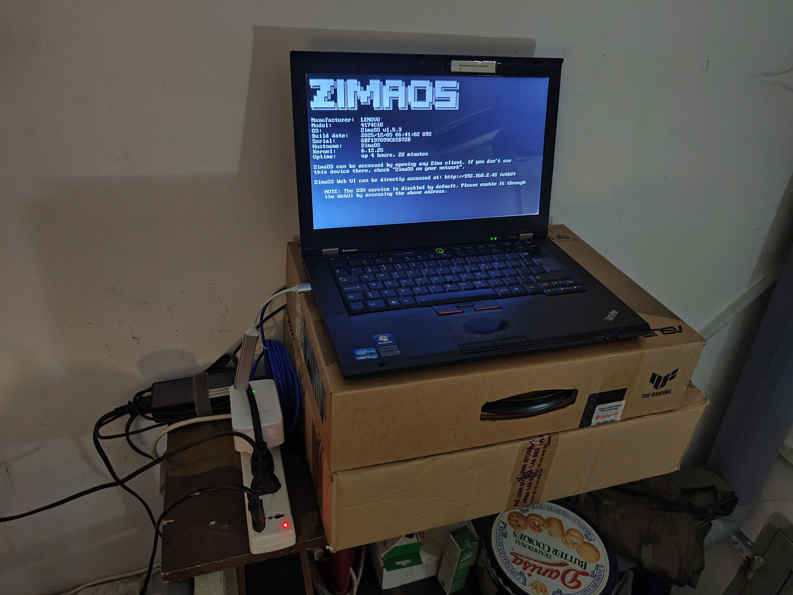
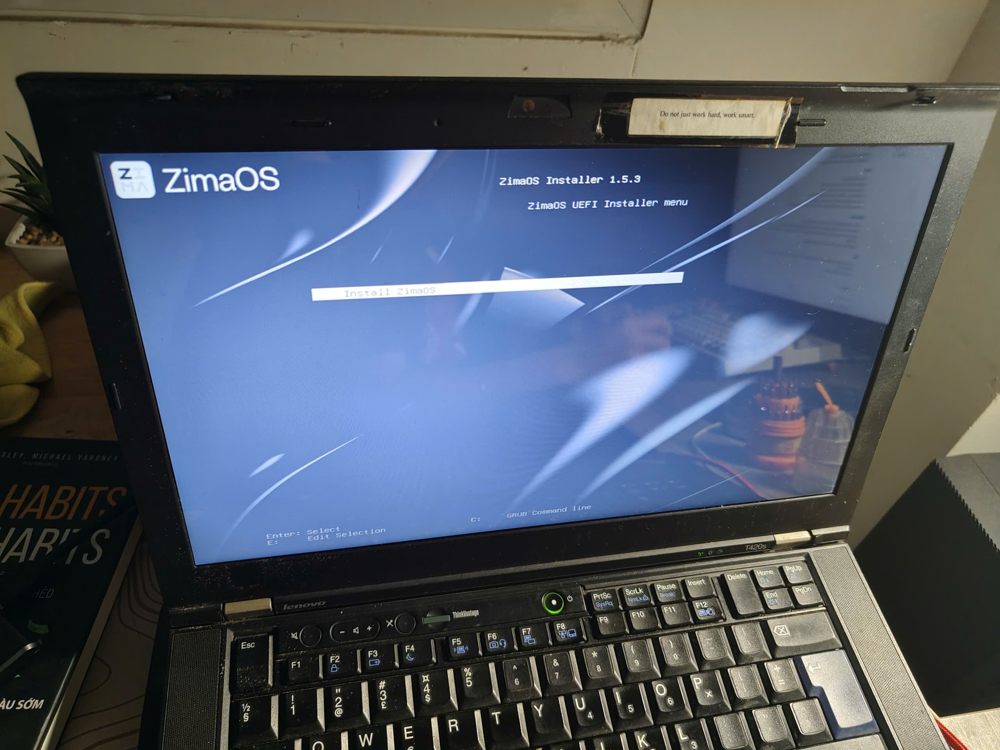

# MyHomeLab ZimaOS Knowledge Base

Welcome to the documentation for my ZimaOS Home Lab. This repository serves as the central configuration and knowledge base for all self-hosted services.


## Overview

This lab hosts a variety of services ranging from development tools (Jira, Jenkins) to personal projects (SnakeAI, FengShuiKoi).

## Quick Links

- [**Getting Started**](docs/getting-started.md): How to deploy these apps.
- [**Applications**](docs/apps/README.md): Detailed guides for each service.
- [**Agent Guidance**](docs/agents.md): For AI Agents modifying this repo.
- [**Infrastructure**](docs/apps/jenkins/jenkins.md): CI/CD and system tools.

## Gallery


<table>
  <tr>
    <td></td>
    <td></td>
  </tr>
  <tr>
    <td></td>
    <td></td>
  </tr>
</table>

## Documentation

To view the full documentation site locally:
```bash
npx docsify-cli@latest serve docs
```
